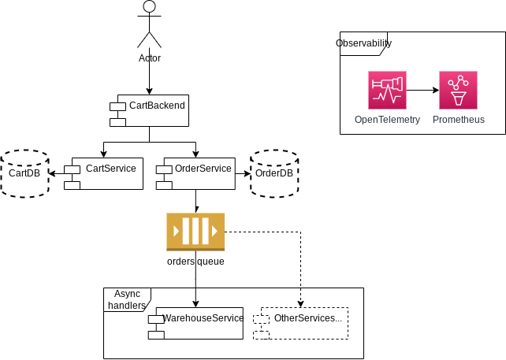

# MARKET

## Summary

Observability playground project.

Collecting traces and metrics with OpenTelemetry. Exporting metrics to
Prometheus. Visualization with Grafana for metrics and Jaeger for tracing.

### Start the project

```commandline
docker-compose up -d
```

### Tools' links
* Grafana: http://localhost:3000/
* Jaeger: http://localhost:16686/
* CartBackend: http://localhost:8001/docs
* OrderService: http://localhost:8002/docs
* CartService: http://localhost:8003/docs
* RabbitMQ: http://localhost:15672/

## Microservices' architecture

Extremely simple microservices cluster. It represents cart in online marketplace.


